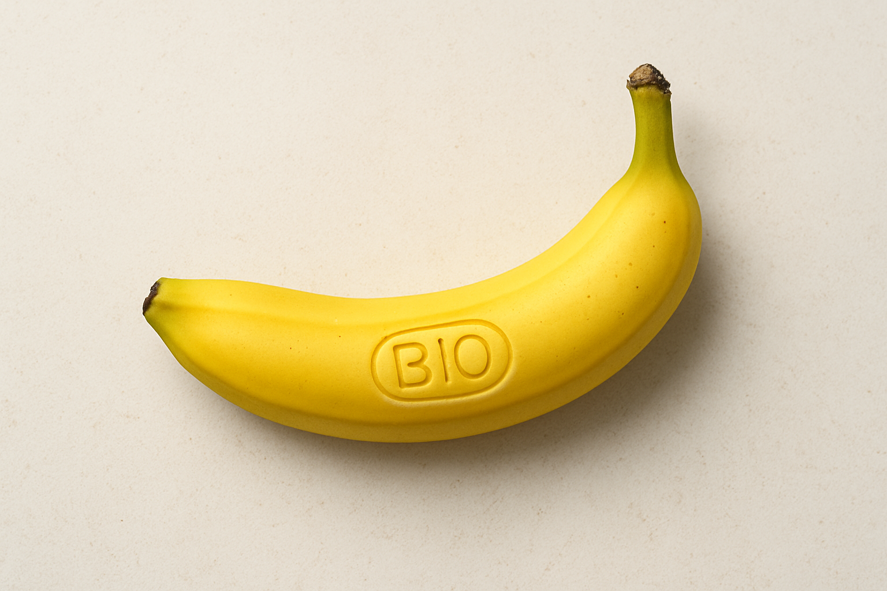

# Wieso eigentlich der Aufkleber auf den Bananen?

## Tethered Caps 
Seit dem 03. Juli 2024 ist das Einwegkunststoffkennzeichnungsverordnung - EWKKennzV in Kraft getreten. Dabei wurde festgelegt, dass Getränkebehälter [...], die Einwegkunststoffprodukte sind und deren Verschlüsse oder Deckel ganz oder teilweise aus Kunststoff bestehen, nur in den Verkehr gebracht werden dürfen, wenn die Verschlüsse oder Deckel während der vorgesehenen Verwendungsdauer am Behälter befestigt bleiben (§ 3 Absatz 1 Satz 1 EWKKennzV).^1

Ziel ist, die Umwelt, insbesondere die Meere, vor dem Eintrag von Plastik und dessen negativen Auswirkungen zu schützen.

Nach dem Motto "Kleinvieh macht auch Mist". Für die Umsetzung der "Tethered Caps" gibt es auch eine Menge Kritik.

## Bananen-Aufkleber

> Eine Frage die sich mir dabei jedes mal stellte, wenn ich eine Banane schälte: "Wieso ist dieser Aufkleber eigenlich auf gefühlt jeder zweiten Banane und warum geht dieser so schwer ab?"

Dient der Aufkleber ausschließlich zur Unterscheidung der Bananen? Bio, Normal, Chiquita?
Es ist furchtbar nervig den Aufkleber immer abzuziehen. Ich will nicht wissen, wie häufig die Aufkleber samt Bananenschale im Bio-Müll landen.

Matthias Jung hat das auf seinem Blog ganz passend formuliert:https://blog.matthias-jung.de/2014/01/09/bio-bananen-plastikaufkleber-und-bewahrung-der-schopfung/ (Beitrag aus 2014 - ob WWF mittlerweile geantwortet hat?)

## Lösung? Bananen-Prägung

Wäre eine Lösung nicht einfach eine Prägung? (siehe KI-generiertes Bild)

^1: https://www.gesetze-im-internet.de/ewkkennzv/BJNR202400021.html